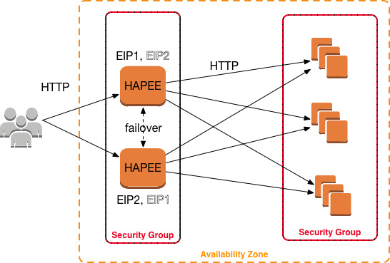

# HAPEE HA active-active with Heartbeat

This is a complete [Terraform](https://www.terraform.io/) + [Ansible](https://www.ansible.com/) HA stack for creating an active-active 2-node HAProxy Enterprise [HAPEE](https://www.haproxy.com/products/haproxy-enterprise-edition/) cluster on AWS. Stack has active EIP failover (EIP1 and EIP2) between HAPEE load-balancers with active failback and failforward through [Heartbeat HA](http://linux-ha.org/wiki/Heartbeat); and configurable number of Web backends in this case several [Caddy HTTP](https://caddyserver.com/) servers (typically 3 or more) serving demo page.

All servers are in a single AZ, HAPEEs are doing HTTP proxying towards backends and there is no ELB or ALB required. DNS entry for a domain label served from our cluster would have both EIPs as A record for that label to be able to serve from both EIPs in a round-robin fashion.



This stack consists of the following key resources:

- configurable amount of Caddy Web servers, as per _web\_cluster\_size_ variable (default 3)
- non-configurable amount of HAPEE load-balancers (default 2 and cannot be changed)

Network-wise, stack uses CIDR **20.0.0.0/8** in a single VPC and a single AZ. Given the overall size of the whole example (Terraform code and Ansible playbook) network setup was intentionally simplified to increase overall readability.

Security-wise, HAPEE and Web servers have each own their SGs. HAPEE SG permits ingress **ICMP type 3 code 4** (MTU Discovery wise) from anywhere, port **tcp/22** (SSH) from everywhere, **tcp/80** and **tcp/443** (HTTP and HTTPS) from anywhere, port **udp/694** (Heartbeat unicast) inside the group, **tcp/9022** and **tcp/9023** (HAPEE Dashboard UI) from everywhere and all egress traffic. Web servers' SG permits **tcp/22** (SSH) from everywhere and **tcp/80** (HTTP) from load-balancers as well as all egress traffic.

Terraform will create whole stack as well as proper required EIP/ENI policy and assign role to HAPEE load-balancers. Software installation however handles Ansible.

Ansible roles in **site.yml** playbook are:

- configuring HAPEE LB nodes:
  - secondary-ip: ensures that each HAPEE instance is able to configure secondary private IP on boot, as that doesn't happen by default on Amazon EC2
  - ec2facts: gathers ENI and EIP facts for further use in Heartbeat EIP helper scripts
  - hapee-lb: auto-generates hapee-lb.cfg configuration file from a Jinja2 template and populates Web node backends' private IPs in backend server definition
  - heartbeat: handles complete HA Heartbeat installation with all prerequisites and configuration (ha.cf, authkeys, haresources, updateEIP1 and updateEIP2 resource agent scripts) on both load-balancer nodes; note that helper scripts differ between load-balancer nodes
- configuring Web backend nodes:
  - caddy: handles installation and configuration of Caddy HTTP server

Ansible 2.6+ is required and Python jmespath is also needed:

```shell
apt install python-pip
pip install jmespath
pip install git+https://github.com/ansible/ansible.git@devel
```

To run this demo:

```shell
terraform init
terraform apply -auto-approve
sleep 10
ansible-playbook site.yml 
```

Real life situation would:

- use multiple AZ and cross-zone balancing
- use HTTPS on HAPEE load-balancer frontends
- optionally use HTTPS on backends as well
- have more complex anti-DOS, connection tracking, device fingerprinting etc. rules in HAPEE configuration
- have more complex Web app in the backend...